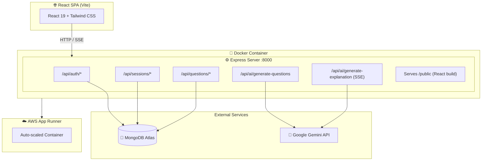
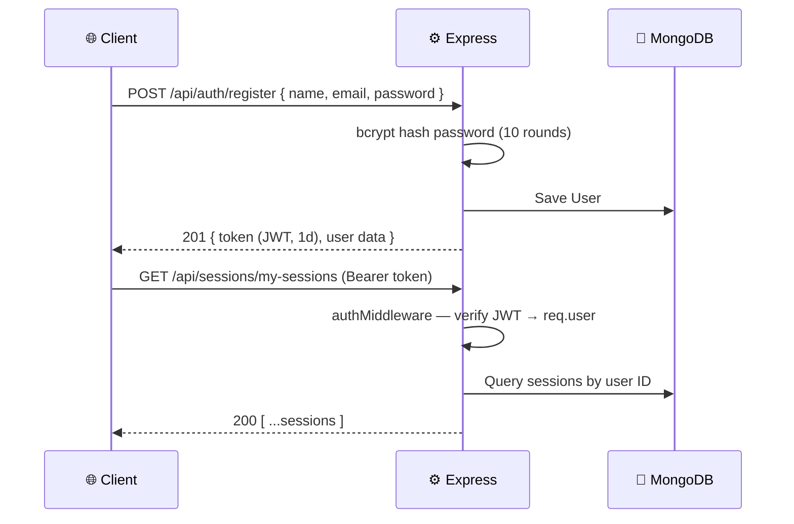

<div align="center">

# 🧠 PrepAI — AI-Powered Interview Preparation

**Personalized interview questions & real-time concept explanations powered by Google Gemini.**

[](https://react.dev/)
[](https://vitejs.dev/)
[](https://tailwindcss.com/)
[](https://nodejs.org/)
[](https://expressjs.com/)
[](https://www.mongodb.com/atlas)
[](https://ai.google.dev/)
[](https://www.docker.com/)
[](https://aws.amazon.com/apprunner/)
[](./LICENSE)

</div>

---

## 📌 Overview

**PrepAI** is a full-stack MERN application that generates tailored technical interview questions based on your **job role**, **experience level**, and **focus topics** using **Google Gemini AI**. Concept explanations stream in real time via SSE — token by token, just like ChatGPT. Users manage sessions, pin important questions, and add personal notes.

The app is fully **Dockerized** (multi-stage build) and deployed on **AWS App Runner**, with the React SPA served directly from the Express backend.

---

## ✨ Key Features

- 🎯 **AI Question Generation** — Gemini produces tailored Q&A pairs as clean JSON
- ⚡ **Real-Time Streaming** — Concept explanations stream live via Server-Sent Events
- 📁 **Session Management** — Create, browse, and delete interview prep sessions
- 📌 **Pin & Notes** — Bookmark key questions and attach personal notes
- 🔐 **JWT Authentication** — Secure register/login with bcrypt-hashed passwords
- 🖼️ **Profile Image Upload** — Multer-powered image upload served statically
- 🐳 **Dockerized** — Single-image full-stack deployment via multi-stage build
- ☁️ **AWS App Runner** — Auto-scaling production deployment

---

## 🛠️ Tech Stack

| Layer | Technology |
|---|---|
| **Frontend** | React 19, Vite 7, Tailwind CSS 4, Framer Motion, React Router 7, Axios, React Markdown, React Syntax Highlighter |
| **Backend** | Node.js 20, Express 5, Mongoose 8, JWT, bcryptjs, Multer, dotenv |
| **Database** | MongoDB Atlas |
| **AI** | Google Gemini 2.5 Flash Lite (`@google/genai` v1.9+) |
| **Deployment** | Docker (multi-stage), AWS App Runner |

---

## 🏗️ Architecture



---

## 📂 Folder Structure

```
PrepAI/
├── Dockerfile                   # Multi-stage build
├── backend/
│   ├── server.js                # Entry point & route registration
│   ├── config/db.js             # MongoDB Atlas connection
│   ├── controllers/
│   │   ├── aiController.js      # Gemini Q&A & SSE streaming
│   │   ├── authController.js    # Register, login, profile
│   │   ├── sessionController.js # Session CRUD
│   │   └── questionController.js# Pin, note, bulk add
│   ├── middlewares/
│   │   ├── authMiddleware.js    # JWT protect
│   │   └── uploadMiddleware.js  # Multer config
│   ├── models/                  # user.js, session.js, question.js
│   ├── routes/                  # authRoutes, sessionRoutes, questionRoutes
│   ├── utils/prompts.js         # Gemini prompt templates
│   └── uploads/                 # Served profile images
└── frontend/
    └── src/
        ├── pages/               # LandingPage, Auth, Home, InterviewPrep
        ├── components/          # Cards, Inputs, Loader, Modal, Drawer
        ├── context/             # Auth context
        └── utils/               # Axios instance, helpers
```

---

## 📡 API Endpoints

| Method | Endpoint | Auth | Description |
|---|---|:---:|---|
| `POST` | `/api/auth/register` | ❌ | Register new user |
| `POST` | `/api/auth/login` | ❌ | Login, receive JWT |
| `GET` | `/api/auth/profile` | ✅ | Get user profile |
| `POST` | `/api/auth/upload-image` | ❌ | Upload profile picture |
| `POST` | `/api/sessions/create` | ✅ | Create interview session |
| `GET` | `/api/sessions/my-sessions` | ✅ | List user's sessions |
| `GET` | `/api/sessions/:id` | ✅ | Get session with questions |
| `DELETE` | `/api/sessions/:id` | ✅ | Delete a session |
| `POST` | `/api/questions/add` | ✅ | Bulk-add questions to session |
| `GET` | `/api/questions/:id/pin` | ✅ | Toggle pin on a question |
| `GET` | `/api/questions/:id/note` | ✅ | Update question note |
| `POST` | `/api/ai/generate-questions` | ✅ | Generate Q&A via Gemini |
| `POST` | `/api/ai/generate-explanation` | ✅ | Stream concept explanation (SSE) |

---

## 🌊 Streaming (SSE) Implementation

```js
// backend/controllers/aiController.js
res.setHeader("Content-Type", "text/event-stream");
res.setHeader("Cache-Control", "no-cache");
res.setHeader("Connection", "keep-alive");
res.flushHeaders();

const streamResult = await ai.models.generateContentStream({
  model: "gemini-2.5-flash-lite",
  contents: prompt,
});

for await (const chunk of streamResult) {
  res.write(`data: ${JSON.stringify({ chunk: chunk.text })}\n\n`);
}
res.write(`data: ${JSON.stringify({ done: true })}\n\n`);
res.end();
```

---

## 🔑 Authentication Flow



---

## 🚀 Installation & Running Locally

### Prerequisites
- Node.js ≥ 20, npm ≥ 10
- MongoDB Atlas URI
- [Google Gemini API Key](https://aistudio.google.com/app/apikey)

### Setup

```bash
# 1. Clone
git clone https://github.com/yourusername/PrepAI.git
cd PrepAI

# 2. Backend
cd backend && npm install

# 3. Frontend
cd ../frontend && npm install
```

### Environment Variables

**`backend/.env`**
```env
MONGO_URI=mongodb+srv://<user>:<pass>@cluster0.mongodb.net/prepai
JWT_SECRET=your_jwt_secret_here
GEMINI_API_KEY=your_gemini_api_key_here
PORT=8000
```

**`frontend/.env`**
```env
VITE_BASE_URL=http://localhost:8000
```

### Run

```bash
# Terminal 1 — Backend (http://localhost:8000)
cd backend && npm run dev

# Terminal 2 — Frontend (http://localhost:5173)
cd frontend && npm run dev
```

---

## 🐳 Docker Setup

```bash
# Build
docker build -t prepai:latest .

# Run
docker run -p 8000:8000 \
  -e MONGO_URI="..." \
  -e JWT_SECRET="..." \
  -e GEMINI_API_KEY="..." \
  prepai:latest
```

The multi-stage Dockerfile builds the React app in Stage 1, then copies the `dist/` output into `backend/public/` in Stage 2. Express serves the SPA statically and falls back to `index.html` for all unmatched routes.

---

## ☁️ AWS Deployment (App Runner)

1. Push image to **Amazon ECR**
2. Create an **App Runner** service from the ECR image
3. Set `MONGO_URI`, `JWT_SECRET`, and `GEMINI_API_KEY` under **Environment Variables**
4. App Runner handles HTTPS, auto-scaling, and zero-downtime deploys automatically

---

## 🧠 Prompt Engineering

Two prompt templates in [`backend/utils/prompts.js`](./backend/utils/prompts.js):

- **`questionAnswerPrompt`** — Instructs Gemini to return a strict JSON array of `{ question, answer }` objects with no extra text, ensuring `JSON.parse()` succeeds without preprocessing beyond stripping code fences.
- **`conceptExplainPrompt`** — Instructs Gemini to start with a Markdown `# H1` title, then stream the full explanation with fenced code blocks. Raw Markdown chunks are forwarded via SSE and rendered client-side by `react-markdown` + `remark-gfm`.

---

## 🔮 Future Enhancements

- [ ] 🎤 Voice-based mock interviews with AI feedback
- [ ] 📊 Performance analytics across sessions
- [ ] 🔗 LinkedIn / GitHub profile auto-import
- [ ] 🌐 Multi-language question generation
- [ ] 📱 React Native mobile companion app

---

## 🤝 Contributing

```bash
git checkout -b feature/your-feature
git commit -m "feat: describe your change"
git push origin feature/your-feature
# Open a Pull Request against main
```

---

## 📄 License

MIT — see [`LICENSE`](./LICENSE)

---

<div align="center">

**Built by Rahul Kumar**

[](https://github.com/yourusername)
[](https://linkedin.com/in/yourprofile)

_If PrepAI helped you, consider giving it a ⭐_

</div>
